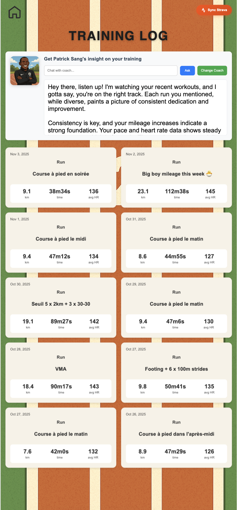
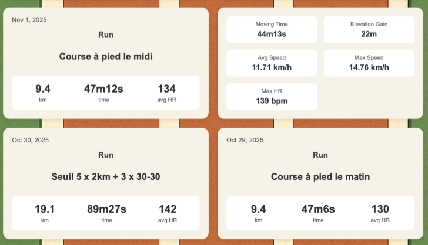
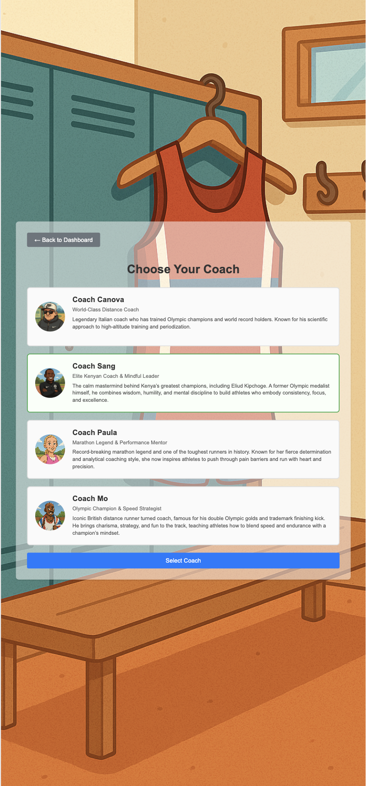
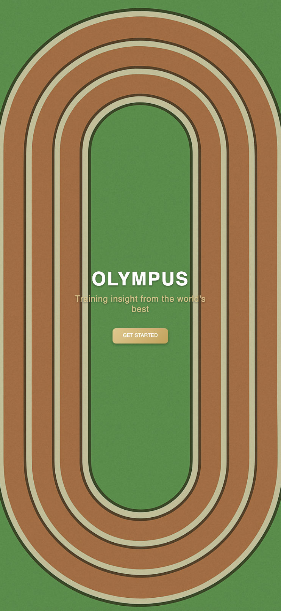
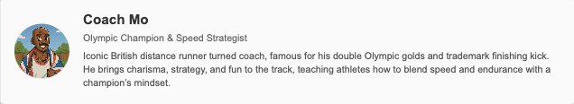

# Olympus — Personalized AI Training Insights from real life coaches

**An AI-powered running coach that analyzes past sessions fetched from Strava and provides personalized insights inspired by the personality of world class coaches.**  

## Demo Preview

  
  
  

  
  

## Project Overview

The app connects to your **Strava account** to analyze 20 most recent workouts (distance, duration, heart rate, etc.) it generate **customized feedback** from virtual elite coaches like *Coach Sang, Coach Canova, Coach Paula,* or *Coach Mo*. Each with a distinct coaching personality. You can chat with the coaches through the app in a conversation-like informal experience. 

The AI interprets your training consistency, trends, and areas for improvement using **natural language generation** and **structured prompt engineering**.

## Tech Stack

| Component | Description |
|------------|-------------|
| **Backend** | Flask (Python) |
| **Database** | SQLite for local storage of workout and athlete data |
| **Frontend** | HTML/CSS + custom UI inspired by track & field visuals |
| **AI Engine** | Gemma 2B (via Ollama) for local LLM inference |
| **API Integration** | Strava API for workout synchronization |
| **Prompt Engineering** | Dynamic personality-based prompts for each coach |
| **Data Persistence** | SQL queries for structured workout retrieval and historical trend analysis |

## Strava API Integration

The app connects to the **Strava REST API** to fetch an athlete’s latest activities:

- OAuth2 authentication flow  
- Retrieval of key metrics: `distance`, `moving_time`, `avg_hr`, `elevation_gain`  
- Automatic storage in SQLite for subsequent analysis  
- Sync triggered from the UI (“Sync Strava” button)